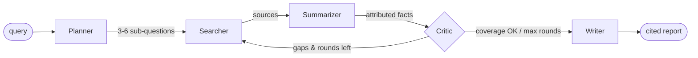

# 🔎 Autonomous Research Assistant

A full-stack, multi-agent system that researches a topic end-to-end —
**plans → searches → summarizes → fact-checks → writes a cited report** — and
streams every agent's progress to the browser in real time.

- **Backend:** FastAPI (Python 3.11+) + LangGraph + Groq (`llama-3.3-70b-versatile`)
- **Frontend:** Angular 20 (standalone components) + ngx-markdown
- **Search:** Tavily → **keyless DuckDuckGo** (real web results, no key needed)
  → offline **mock** fallback, so the app produces useful reports with zero API keys
- **Streaming:** Server-Sent Events (SSE) for live per-agent progress

---

## Table of contents
- [Architecture](#architecture)
- [The five agents](#the-five-agents)
- [Design guarantees](#design-guarantees)
- [Project layout](#project-layout)
- [Setup — API keys](#setup--api-keys)
- [Run locally](#run-locally)
- [Run with Docker](#run-with-docker)
- [API reference](#api-reference)
- [Configuration](#configuration)

---

## Architecture

```
┌──────────────────────────┐         ┌───────────────────────────────────────┐
│        Angular SPA        │         │             FastAPI backend           │
│                           │  POST   │                                       │
│  research-input  ─────────┼────────▶│  POST /api/research  → research_id    │
│  agent-timeline  ◀────SSE─┼─────────│  GET  /api/research/{id}/stream (SSE) │
│  report-view              │  GET    │  GET  /api/research/{id}  (final)     │
│  source-list              │◀────────│                                       │
└──────────────────────────┘         │            LangGraph engine           │
                                      │   planner→searcher→summarizer→        │
                                      │   critic→(loop)→writer                │
                                      └───────────────┬───────────────────────┘
                                                      │
                                   ┌──────────────────┴──────────────────┐
                                   │                                      │
                              Groq (ChatGroq)                    Tavily  /  Mock
                              LLM for every agent                web search
```

### Agent flow (LangGraph state machine)



The **blackboard** state (a `TypedDict`) flows through every node:

```
query → sub_questions → sources[] → facts[] → gaps[] → round_count → final_report
```

Each node reads what it needs and returns a partial update that LangGraph
merges in. `sources` and `facts` use append reducers so they accumulate across
re-search rounds.

---

## The five agents

| # | Agent | Responsibility |
|---|-------|----------------|
| 1 | **Planner** | Decomposes the query into 3–6 focused sub-questions + a short research plan. |
| 2 | **Searcher** | Runs a web search per sub-question (Tavily → DuckDuckGo → mock), collecting URLs + snippets as citable sources (`S1`, `S2`, …). On re-search rounds it targets the open gaps and de-duplicates by URL. |
| 3 | **Summarizer** | **Hierarchical summarization** — summarizes *each source individually* into atomic facts, each keeping its `source_id`, before any final synthesis. |
| 4 | **Critic** | Cross-checks facts against the sub-questions, flags gaps and contradictions, and decides whether to re-search (back to Searcher) or proceed (to Writer). |
| 5 | **Writer** | Compiles a structured, cited Markdown report: executive summary, thematic sections, a "Disagreements & Open Gaps" note, and a Sources list. |

Agent prompts live as clearly labelled, editable string constants at the top of
each file in `backend/app/agents/` (look for `# === EDITABLE PROMPT ===`).

---

## Design guarantees

- **Citation integrity** — every claim maps to a real collected source. The
  Writer only receives facts that already carry a real `source_id`; after
  generation, any `[S#]` citation that doesn't map to a collected source is
  stripped, and the **Sources section is generated from the collected source
  list, never the model** (URLs are never invented).
- **Bounded loop** — a hard cap of `MAX_RESEARCH_ROUNDS` (default **2**)
  re-search rounds, and the loop also stops early if a round finds **no new
  sources**. All termination logic lives in the Critic.
- **Surfacing disagreement** — when sources contradict, the report presents
  both sides in a dedicated section rather than silently picking one.
- **Graceful degradation** — with no `GROQ_API_KEY` the agents fall back to
  deterministic heuristics; with no `TAVILY_API_KEY` the Searcher uses keyless
  DuckDuckGo (and only falls back to mock if that's unreachable). The whole
  pipeline runs end-to-end and still produces real, cited reports.

---

## Project layout

```
Research-assistant/
├── docker-compose.yml          # run both services together
├── .env.example                # root env (used by docker-compose)
├── backend/
│   ├── app/
│   │   ├── main.py             # FastAPI app, CORS, health, routes
│   │   ├── config.py           # pydantic Settings (.env)
│   │   ├── api/routes.py       # POST /research, GET /stream (SSE), GET result
│   │   ├── agents/
│   │   │   ├── state.py        # LangGraph TypedDict blackboard
│   │   │   ├── graph.py        # builds + compiles the graph (loop edge)
│   │   │   ├── planner.py searcher.py summarizer.py critic.py writer.py
│   │   ├── services/
│   │   │   ├── llm.py          # ChatGroq client factory
│   │   │   ├── search.py       # Tavily wrapper + mock fallback
│   │   │   └── jobs.py         # background job runner + SSE event buffer
│   │   └── models/schemas.py   # Pydantic request/response models
│   ├── requirements.txt
│   ├── Dockerfile
│   └── .env.example
└── frontend/
    ├── src/app/
    │   ├── app.ts/.html/.scss  # orchestrator
    │   ├── components/         # research-input, agent-timeline, report-view, source-list
    │   ├── services/research.service.ts   # POST + EventSource SSE
    │   └── models/research.model.ts
    ├── proxy.conf.json         # dev proxy: /api → :8000
    ├── nginx.conf              # prod SPA + SSE reverse-proxy
    ├── Dockerfile
    └── package.json
```

---

## Setup — API keys

1. Copy the example env file:
   ```bash
   cp .env.example .env
   ```
2. Add your keys to `.env`:
   - **`GROQ_API_KEY`** — from <https://console.groq.com/keys> (required for
     real LLM output).
   - **`TAVILY_API_KEY`** — from <https://app.tavily.com> (optional; omit to use
     the built-in mock search).

> Keys are **only** read from the environment — nothing is ever hardcoded.
> For local (non-Docker) backend runs you can instead put the same variables in
> `backend/.env` (see `backend/.env.example`).

---

## Run locally

### Backend
```bash
cd backend
python -m venv .venv
# Windows:  .venv\Scripts\activate     |  macOS/Linux:  source .venv/bin/activate
pip install -r requirements.txt
cp .env.example .env          # add your keys (optional for mock mode)
uvicorn app.main:app --reload
```
Backend runs at <http://localhost:8000> — check <http://localhost:8000/health>.

### Frontend
```bash
cd frontend
npm install
npm start          # == ng serve, with proxy.conf.json → backend :8000
```
Open <http://localhost:4200>. The dev proxy forwards `/api/*` to the backend, so
there are no CORS issues during development.

---

## Run with Docker

```bash
cp .env.example .env           # add your keys
docker compose up --build
```
- Frontend (nginx): <http://localhost:4200>
- Backend (FastAPI): <http://localhost:8000>

nginx serves the built Angular app and reverse-proxies `/api/*` (including the
SSE stream, with buffering disabled) to the backend container.

---

## API reference

| Method | Path | Description |
|--------|------|-------------|
| `POST` | `/api/research` | Body `{ "query": "..." }` → `{ "research_id": "..." }`. Starts a background run. |
| `GET`  | `/api/research/{id}/stream` | **SSE** stream of `progress` events: `{ agent, status, message, data }`, plus `done`/`ping` events. Replays buffered events to late subscribers. |
| `GET`  | `/api/research/{id}` | Final result: Markdown report + structured `sources[]`, `facts[]`, `gaps[]`. |
| `GET`  | `/health` | Readiness + LLM/search configuration. |

Example:
```bash
ID=$(curl -s -XPOST localhost:8000/api/research -H 'Content-Type: application/json' \
      -d '{"query":"effects of caffeine on sleep"}' | python -c "import sys,json;print(json.load(sys.stdin)['research_id'])")
curl -N localhost:8000/api/research/$ID/stream     # watch live events
curl -s localhost:8000/api/research/$ID            # final report JSON
```

---

## Configuration

All settings are environment variables (see `.env.example`):

| Variable | Default | Purpose |
|----------|---------|---------|
| `GROQ_API_KEY` | — | Groq key (required for live LLM). |
| `GROQ_MODEL` | `llama-3.3-70b-versatile` | Main model (outliner, section writer, report agents). |
| `GROQ_FAST_MODEL` | `llama-3.1-8b-instant` | Cheaper model for summarize/paraphrase/tables/figures. |
| `GROQ_BASE_URL` | `https://api.groq.com/openai/v1` | Groq OpenAI-compatible endpoint. |
| `TAVILY_API_KEY` | — | Tavily key (optional; DuckDuckGo/mock fallback otherwise). |
| `MAX_RESEARCH_ROUNDS` | `2` | Hard cap on Critic→Searcher re-search rounds. |
| `SEARCH_RESULTS_PER_QUERY` | `4` | Results fetched per sub-question. |
| `LLM_MIN_INTERVAL_SECONDS` | `2.0` | Min spacing between LLM calls (throttle). |
| `LLM_MAX_RETRIES` | `5` | Retries on HTTP 429 before giving up. |
| `LLM_MAX_BACKOFF_SECONDS` | `90` | Max backoff per retry; larger waits ⇒ daily-cap, fail fast. |
| `VERIFY_SSL` | `true` | Verify HTTPS via OS cert store (corporate proxies). |
| `CORS_ORIGINS` | `http://localhost:4200,...` | Allowed frontend origins. |
| `LOG_LEVEL` | `INFO` | Backend log level. |

---

## IEEE paper generator

Beyond quick reports, the app can generate a full **IEEE-format conference paper**
(switch to the *🎓 IEEE Paper* mode in the UI, or use the API below).

**Pipeline (extra agents on top of the research front-half):**

```
outliner → searcher → summarizer → critic ⇄ (re-search loop)
        → section_writer → verifier → plagiarism_check
        → table_builder → figure_builder → reference_builder → assembler
```

- **Outliner** — proposes the title, index terms, a 7–8 section IEEE plan, and 7–9 research
  questions (targets a full 6–7 page paper).
- **Section Writer** — writes each section (Intro, Background, Related Work, Methodology,
  Applications, Challenges, Discussion, Conclusion) + Abstract, in 3–5 paragraphs each,
  grounded only in retrieved facts, citing `[S#]`.
- **Verifier** — strips any citation that doesn't map to a real source; reports verified claims.
- **Plagiarism check** — measures word n-gram overlap of every sentence against the *actual
  retrieved source text*, **paraphrases** flagged passages with the LLM, then re-measures and
  reports the pre→post originality score. (Built-in similarity check, **not** a certified
  Turnitin/iThenticate scan.)
- **Table builder** — synthesises one grounded comparison/summary table.
- **Figure builder** — generates one diagram (process flow or concept map) as a PNG via
  matplotlib.
- **Reference builder** — numbers cited sources `[1..n]` and formats an IEEE reference list.
- **Assembler** — renders the Markdown preview; a `python-docx` exporter produces a two-column
  IEEE `.docx` with the embedded figure and native table.

**Performance / cost:** high-volume agents (summarize, paraphrase, tables, figures) use a
cheaper fast model (`GROQ_FAST_MODEL`, default `llama-3.1-8b-instant`), and all LLM calls go
through a **rate limiter + 429 backoff** (`LLM_MIN_INTERVAL_SECONDS`, `LLM_MAX_RETRIES`,
`LLM_MAX_BACKOFF_SECONDS`) so generation rides under per-minute limits instead of failing.
A per-*day* token exhaustion is detected (large suggested wait) and surfaced rather than
blocking for tens of minutes.

**API:**

| Method | Path | Description |
|--------|------|-------------|
| `POST` | `/api/paper` | `{ topic, details?, authors? }` → `{ paper_id }`. |
| `GET`  | `/api/paper/{id}/stream` | SSE progress (same event shape as research). |
| `GET`  | `/api/paper/{id}` | Structured paper: title, abstract, sections, references, originality + verification reports. |
| `GET`  | `/api/paper/{id}/docx` | Download the IEEE-formatted Word document. |

> **Honest scope:** this produces a well-structured, fully-cited IEEE **draft** with
> multi-agent fact-checking and an originality pass. It is *not* a guaranteed-publishable
> original-research paper — an LLM working from web search can't run real experiments or
> certify novelty, and most venues require disclosure of AI assistance. Treat the output as
> a strong starting draft to refine, verify, and extend with your own contribution.
>
> **Token note:** the paper pipeline makes many LLM calls. On Groq's free tier (~100K
> tokens/day) one or two papers can exhaust the daily budget (you'll see HTTP 429 and the
> agents fall back to degraded output). Use a paid Groq tier or wait for the daily reset.

## Troubleshooting

**Report says "Generated without an LLM" / all sources are `[MOCK]`.**
Every agent fell back because it couldn't reach the LLM/search. Check the backend logs:

- `GROQ_API_KEY is not set` → the key isn't being loaded. Note local runs read
  **`backend/.env`** (relative to where you launch `uvicorn`), not the repo-root
  `.env`. Put your key in `backend/.env`, or run from a dir whose `.env` has it.
- `[SSL: CERTIFICATE_VERIFY_FAILED] self-signed certificate in certificate chain`
  → you're behind a corporate **HTTPS-inspection proxy**. The app trusts the OS
  certificate store via `truststore` (enabled by default, `VERIFY_SSL=true`), which
  resolves this — make sure `truststore` is installed (`pip install -r requirements.txt`)
  and restart. As a last resort you can set `VERIFY_SSL=false` (insecure) in `.env`.

**Confirm everything is wired up:** open <http://localhost:8000/health> — you want
`"llm": {"configured": true}` and `"search": {"live": true}`. Search `mode` will be
`tavily` (if a key is set), `duckduckgo` (keyless real web search), or `mock` (offline
placeholders — only used if DuckDuckGo is unreachable). DuckDuckGo needs no key, so you
get real, fact-grounded reports out of the box; add a `TAVILY_API_KEY` for higher-quality
retrieval.

## Notes & limitations

- Job state is **in-memory** (single process). For production, back the job
  store with Redis and the SSE pub/sub with a real broker.
- The mock search returns clearly-labelled `[MOCK]` placeholders pointing at
  `example.com` so it's obvious when no live search key is configured.
